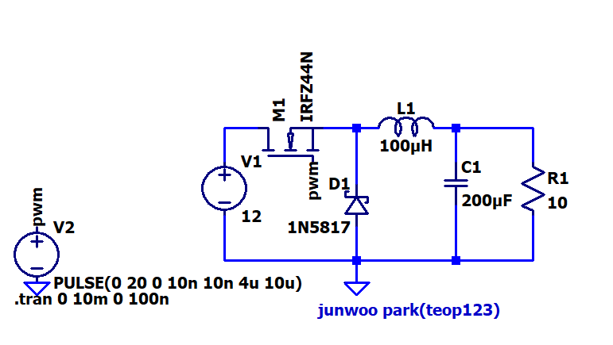
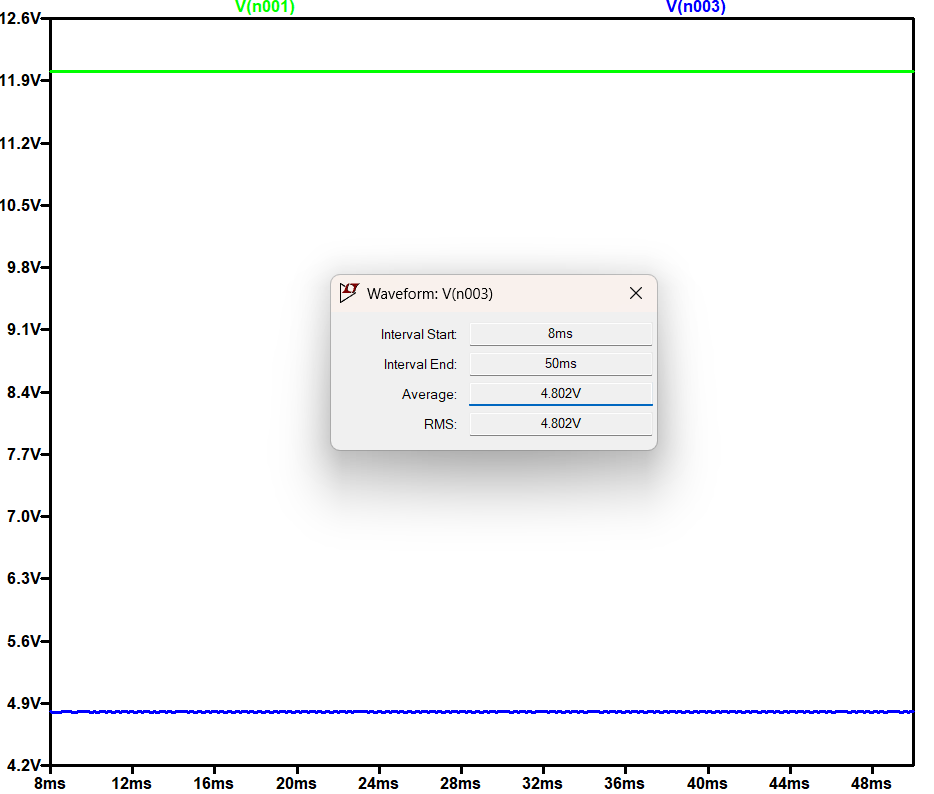
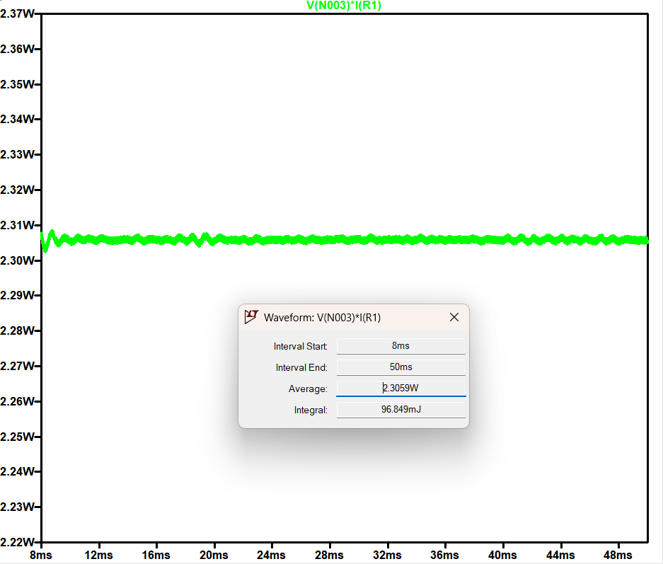
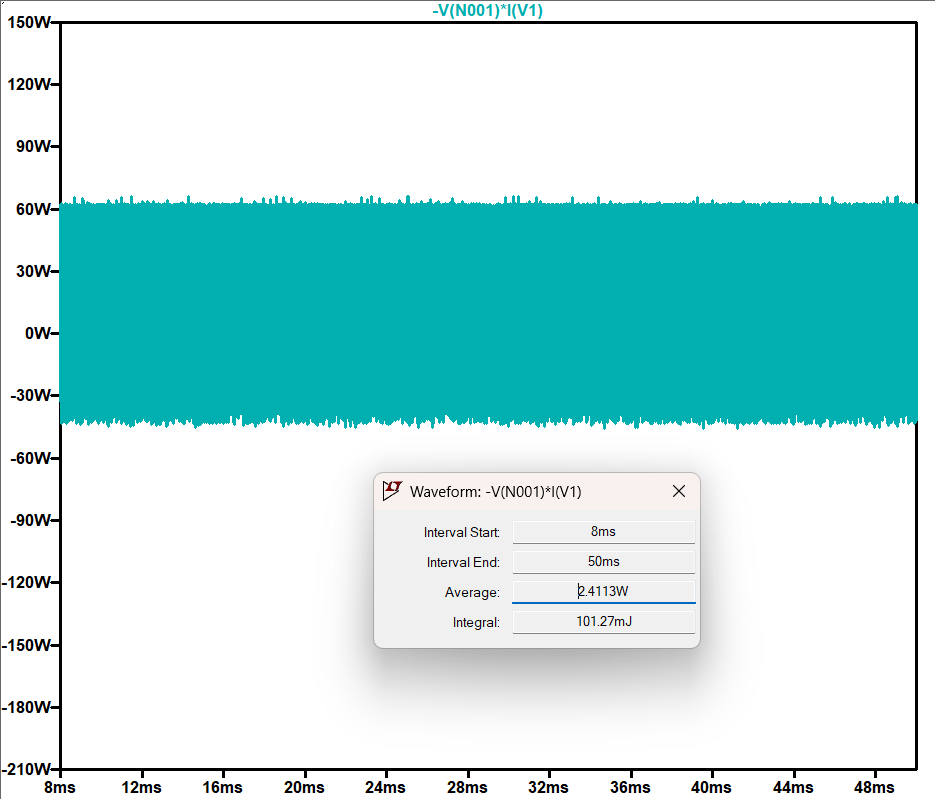
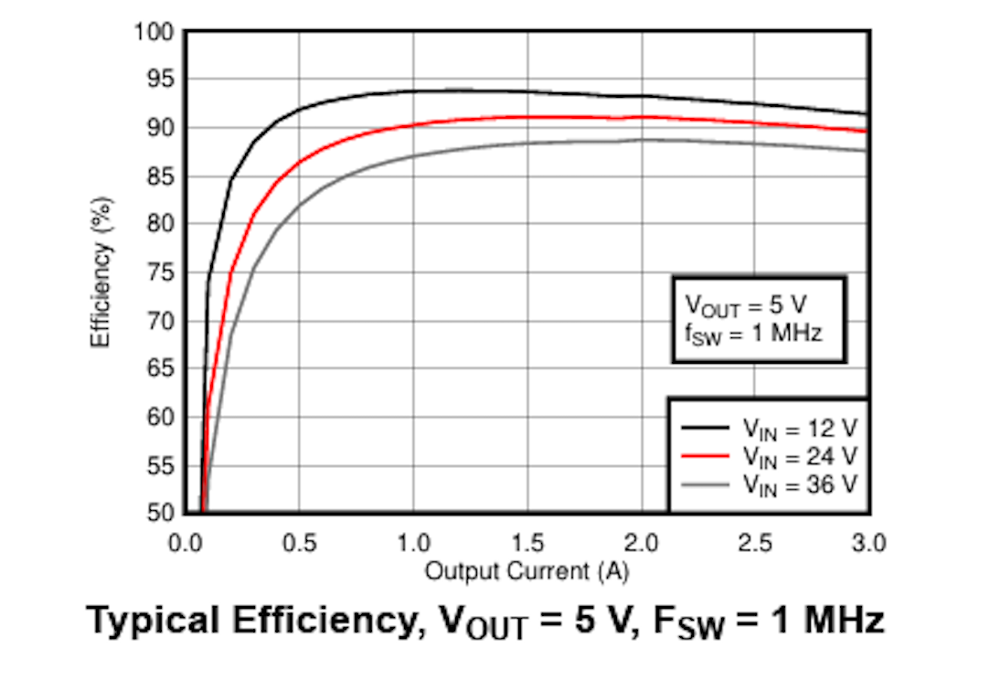
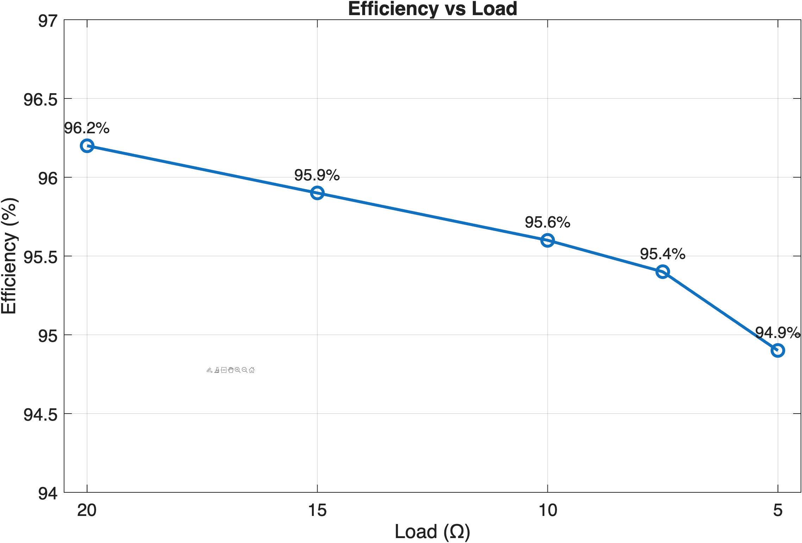
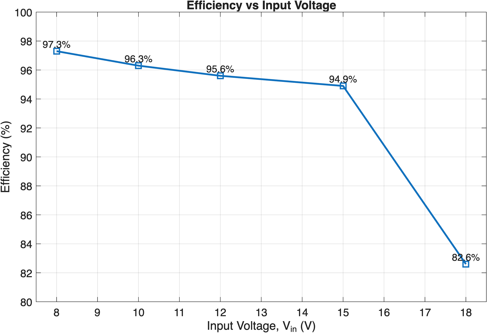

# Buck Converter Efficiency Analysis and Comparison with TI TPSM63603

written by Junwoo Park (teop123)

## Project Overview

This project investigates the design and performance of a discrete buck converter using LTspice. The converter was designed to step down a 12V input to approximately 5V output and was evaluated under different load and input-voltage conditions. The measured steady-state efficiency reached 95.6% at 12V input and 10Ω load. The results were also compared with TI's TPSM63603 commercial buck power module to understand the trade-offs between a simple discrete design and an integrated industrial solution.

## Why This Project Matters

DC-DC converters are one of the most fundamental building blocks in power electronics. In real electronic systems, the available input voltage often does not match the voltage required by the load. This project focuses on the buck converter as a step-down switching regulator and compares its performance with other voltage regulation approaches as well as with a commercial TI power module.

This project is meaningful not only as a circuit design exercise, but also as a practical comparison of efficiency, regulation, and engineering trade-offs across different operating conditions.

## Converter Design

The target of this converter was to step down a 12V input to approximately 5V output while minimizing power loss and maximizing efficiency.

### Key Components
- Input voltage: 12V
- MOSFET: IRFZ44N
- Diode: 1N5817
- Inductor: 100µH
- Capacitor: 200µF
- Load resistor: 10Ω
- PWM gate drive: `PULSE(0 20 0 10n 10n 4.17u 10u)`

### Circuit Schematic

## Duty Cycle and Expected Output

The PWM signal has:
- Period = 10µs
- On-time = 4.17µs

Therefore, the duty cycle is:

D = 4.17 / 10 = 0.417

For an ideal buck converter:

Vout ≈ D × Vin ≈ 0.417 × 12 ≈ 5V

This means the converter was designed to produce about 5V from a 12V source.

## Operating Principle

When the MOSFET is ON, energy is transferred from the input source to the inductor and load, and the inductor stores energy. When the MOSFET is OFF, the diode provides a freewheeling path, allowing the inductor to continue supplying current to the load. The inductor and capacitor smooth the current and voltage, producing a lower average DC output voltage.

## Nominal Performance

The steady-state region from 8ms to 50ms was used for performance evaluation in order to exclude the startup transient.

### Steady-State Voltage

At steady state:
- Input voltage ≈ 12V
- Output voltage ≈ 4.802V

### Output Power

Average output power:
- Pout = 2.3059W

### Input Power

Average input power:
- Pin = 2.4113W

### Efficiency Calculation

Efficiency was calculated using:

η = (Pout / Pin) × 100

Substituting the measured values:

η = (2.3059 / 2.4113) × 100 ≈ 95.6%

Power loss:

Ploss = Pin - Pout = 2.4113 - 2.3059 = 0.1054W

This shows that the converter achieved high-efficiency power conversion under the nominal operating condition.

## Commercial Benchmark: TI TPSM63603

To better understand the practical relevance of the design, the discrete buck converter was compared with TI's TPSM63603.

TPSM63603 is a synchronous buck power module that supports:
- 3V to 36V input
- 1V to 16V output
- up to 3A output current
- integrated MOSFETs, inductor, and controller
- configurable switching frequency
- low EMI
- built-in protection features

### TPSM63603 Overview

### TPSM63603 Efficiency Curve

The discrete buck converter in this project achieved 95.6% steady-state efficiency at 12V input and 10Ω load. Under this limited light-load condition, the efficiency is comparable to the commercial benchmark. However, the TPSM63603 provides much higher integration, wider operating range, and product-ready robustness.

## Performance Across Load Conditions

### Efficiency vs Load

| Load (Ω) | Avg Vout (V) | Avg Pout (W) | Avg Pin (W) | Efficiency (%) |
|---|---:|---:|---:|---:|
| 20 | 4.8268 | 1.1208 | 1.1649 | 96.2 |
| 15 | 4.8170 | 1.5470 | 1.6125 | 95.9 |
| 10 | 4.8020 | 2.3059 | 2.4113 | 95.6 |
| 7.5 | 4.7890 | 3.0588 | 3.2076 | 95.4 |
| 5 | 4.7690 | 4.5490 | 4.7918 | 94.9 |

As load increased, output voltage decreased slightly and efficiency gradually dropped. This indicates that conduction losses increased as load current became larger.

## Performance Across Input Voltage Conditions

### Efficiency vs Input Voltage

| Vin (V) | Duty Cycle | On-Time (us) | Avg Vout (V) | Avg Pout (W) | Avg Pin (W) | Efficiency (%) |
|---|---:|---:|---:|---:|---:|---:|
| 8  | 0.625 | 6.25 | 4.8700 | 2.3749 | 2.4400 | 97.3 |
| 10 | 0.500 | 5.00 | 4.8286 | 2.3315 | 2.4216 | 96.3 |
| 12 | 0.417 | 4.17 | 4.8020 | 2.3059 | 2.4113 | 95.6 |
| 15 | 0.333 | 3.33 | 4.7570 | 2.2629 | 2.3844 | 94.9 |
| 18 | 0.278 | 2.78 | 4.1513 | 1.7233 | 2.0875 | 82.6 |

The converter maintained high efficiency from 8V to 15V, but both efficiency and output regulation degraded at 18V. This suggests that the simple asynchronous buck structure has limitations under higher input-voltage conditions.

## Engineering Insights

This project shows that the converter performs well under nominal and moderate operating conditions, but also reveals practical trade-offs. As load increases, efficiency decreases slightly. As input voltage becomes higher, output regulation and efficiency degrade together. This indicates that a simple asynchronous buck converter is easy to implement and effective as a learning prototype, but it has limitations across a wide operating range.

The performance drop at 18V can be interpreted as the combined effect of diode conduction loss, switching loss, and other non-ideal component losses.

## Future Improvements

Possible next steps include:
- applying synchronous rectification to reduce diode loss
- selecting a more suitable MOSFET and optimizing gate drive conditions
- adding feedback control for better output regulation
- optimizing switching frequency and passive component values to improve efficiency and ripple

## Files Included

- `report.pdf` : full project report
- `images/` : figures used in the report and README
- `ltspice/buck_converter.asc` : LTspice schematic
- `matlab/efficiency_vs_load.m` : MATLAB code for load-efficiency graph
- `matlab/efficiency_vs_input_voltage.m` : MATLAB code for input-voltage-efficiency graph

## Key Takeaway

This project demonstrates not only the design of a buck converter, but also how engineering trade-offs can be explained through measurable performance data and compared with a commercial TI power solution.
